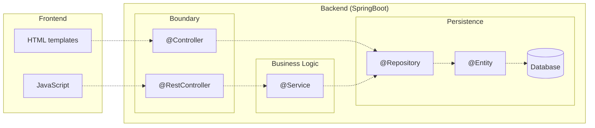

# 3.1 - "Accessing databases in SpringBoot"
## Arquitetura de uma aplicação web SpringBoot
O SpringBoot é uma framework orientada para o desenvolvimento de *backend* e, como tal, permite que uma aplicação web comunique com vários tipos de bases de dados, garantindo a persistência da informação.

Para esse efeito, o *backend* de uma aplicação SpringBoot está habitualmente organizado em três camadas:
- Camada de Controlo (*Boundary*) - a "fronteira" com a camada de apresentação, isto é, com o frontend. É responsável por receber pedidos e enviar respostas, no protocolo HTTP.
- Camada de Serviços (*Buisness Logic*): é responsável por processar as solicitações e gerar as respostas. É aqui que se encontra a lógica de negócio da aplicação e que são injetadas as suas dependências.
- Camada de Persistência (*Persistence*): responsável por armazenar e descarregar conteúdo da base de dados.

>Adaptado do esquema do Prof. Ilídio Oliveira.

## @Bean vs @Component
São duas anotações genéricas que representam componentes do Spring.

```@Bean```: usado para declarar explicitamente um *bean*, ao invés de deixar o Spring fazê-lo automaticamente. Desacopla a declaração do *bean* da definição da classe, dando maior liberdade ao *developer*.

```@Component``` usado para autodeteção e autoconfiguração de *beans*, desencadeando um *scanning* ao *classpath*. Apresenta diferentes especializações, tais como @Controller, @Repository e @Service.

## Jakarta Persistence API (JPA)
A Jakarta Persistence API, anteriormente designada por Java Persistence API, é uma das várias especificações da Java Community Process (JCP) e é implementada por vários frameworks, como o Hibernate, EclipseLink, TopLink, etc. O seu propósito é assegurar a persistência de objetos de uma aplicação em bases de dados. Através de ORM (*Object Relational Mapping*), é possível definir classes Java que representam entidades da base de dados (tabelas, no caso desta ser relacional) e, recorrendo a *annotations*, estabelecer relações essas entre mesmas entidades.

Esta API destinava-se originalmente à comunicação com bases de dados relacionais (Oracle, SQL Server, MySQL, etc.), mas, com o passar do tempo, foi adaptando-se às bases de dados não relacionais, como o MongoDB.

## Dependências utilizadas na resolução do exercício
- **Spring Web**: para desenvolvimento de aplicações Web, nomeadamente RESTful, usando o Spring MVC e o Apache Tomcat como servidor embutido.
- **Thymeleaf Template Engines**: é um mecanismo de *templating*, que atua do lado do servidor e que visa gerar páginas HTML dinâmicas.
- **Spring Data JPA SQL**: permite a comunicação com bases de dados relacionais, sendo o Spring Data o seu intermediário e o Hibernate a implementação da JPA.
- **H2 Database SQL**: base de dados SQL embutida e *in-memory*.
- **Validation I/O**: trata da validação do input e output, recorrendo ao Hibernate *validator*.

## Construção de uma aplicação CRUD
**CRUD**: acrónimo que representa as operações *Create*, *Read*, *Update* e *Delete*.

### Definição da entidade
```java
@Table(name = "table_user") //mapeamento para uma tabela com um nome específico
@Entity //marcação da classe como uma entidade
public class User {
    
    @Id //marcação do atributo como chave primária
    @GeneratedValue(strategy = GenerationType.AUTO) // indica que o valor é gerado automaticamente
    private long id;
    
    @NotBlank(message = "Name is mandatory") // em SQL, equivaleria a um "WHERE name != ''" e "NOT NULL"
    private String name;

    @Column(name = "phone_number") // mapeamento para uma coluna com um nome específico
    private String phone;
    
    [...]
}
```
>**Nota**: a classe User não deve apresentar qualquer construtor explícito, para não entrar em conflito com o construtor sem parâmetros da @Entity.

### Definição do repositório
```java
@Repository
public interface UserRepository extends CrudRepository<User, Long> {}
// Deste modo, é possível utilizar métodos CRUD para interagir com a base de dados, como save(), findAll(), findById(), deleteById(), etc.
```

### Definição do *controller*
```java
@Controller
public class UserController {
    
    private final UserRepository userRepository;

    @Autowired //solicitar ao SpringBoot uma instância do repositório
    public UserController(UserRepository userRepository) {
        this.userRepository = userRepository;
    }

    @PostMapping("/adduser")
    public String addUser(@Valid User user, BindingResult result, Model model) {
        if (result.hasErrors()) {
            return "add-user";
        }
        
        userRepository.save(user); //guardar o utilizador na base de dados
        return "redirect:/index";
    }

    // Outras operações CRUD...
}
```

### Definição das *views*
```html
<form action="#" th:action="@{/adduser}" th:object="${user}" method="post">
    <label for="name">Name</label>
    <input type="text" th:field="*{name}" id="name" placeholder="Name">
    <span th:if="${#fields.hasErrors('name')}" th:errors="*{name}"></span>
    <label for="email">Email</label>
    <input type="text" th:field="*{email}" id="email" placeholder="Email">
    <span th:if="${#fields.hasErrors('email')}" th:errors="*{email}"></span>
    <input type="submit" value="Add User">   
</form>
```
O prefixo "th" indica que o código HTML é interpretado pelo Thymeleaf.
- **th:action** - indica a ação a ser executada, quando o formulário for submetido.
- **th:object** - associa o formulário a um objeto.
- **th:field** - associa o campo a um atributo do objeto.
- **th:if** - indica que o trecho de HTML só deve ser processado, se a condição for verdadeira.
- **th:errors** - indica que o trecho de HTML deve ser processado, caso existam erros associados ao atributo.


## Questões do exercício
### "The 'UserController' class gets an instance of 'userRepository' through its constructor; how is this new repository instantiated?"
O 'userRepository' é uma variável com a keyword ```final```, o que significa que não pode ser alterada, após a sua inicialização. Através da anotação ```@Autowired```, o SpringBoot fornece ao 'UserController' uma instância do repositório.

### "List the methods invoked in the 'userRepository' object by the 'UserController'. Where are these methods defined?"
O userRepository é uma instância da interface UserRepository, que estende a CrudRepository, onde são definidos os seguintes métodos CRUD:
- ```save()```
- ```saveAll()```
- ```findById()```
- ```èxistsById()```
- ```findAll()```
- ```findAllById()```
- ```count()```
- ```deleteById()```
- ```delete()```
- ```deleteAllById()```
- ```deleteAll()```

### "Where is the data being saved? when I call save() from CRUD repository?"
Numa base de dados relacional H2, embutida e *in-memory*.

### "Where is the rule for the “not empty” email address defined?"
Através da anotação ```@NotBlank```.

# 3.2 - "Multilayer applications: exposing data with REST interface"
## Configuração da conexão a uma base de dados MySQL
```
# MySQL
spring.datasource.url=jdbc:mysql://127.0.0.1:33060/demo
spring.datasource.username=demo
spring.datasource.password=secret2
spring.jpa.database-platform=org.hibernate.dialect.MySQL5InnoDBDialect

# Strategy to auto update the schemas (create, create-drop, validate, update)
spring.jpa.hibernate.ddl-auto = update
```
**JDBC (Java Database Conectivity)** é a API Java responsável por gerir a conexão a uma base de dados, transmitindo-lhe comandos SQL e tratando dos respetivos resultados.

## Realização de testes aos *endpoints* da aplicação (com Postman)

### CREATE Employee
**PEDIDO**

Método HTTP: ```POST```

URL: ```http://localhost:8080/api/v1/employees```

Body: ```raw, JSON```
```json
{
    "firstName": "Rafael",
    "lastName": "Gonçalves",
    "emailId": "rfg@ua.pt"
}
```

**RESPOSTA**
```json
{
    "id": 1,
    "firstName": "Rafael",
    "lastName": "Gonçalves",
    "emailId": "rfg@ua.pt"
}
```

### GET Employee by ID
**PEDIDO**

Método HTTP: ```GET```

URL: ```http://localhost:8080/api/v1/employees/1```

Body: ```none```

**RESPOSTA**
```json
{
    "id": 1,
    "firstName": "Rafael",
    "lastName": "Gonçalves",
    "emailId": "rfg@ua.pt"
}
```

### GET all Employees
**PEDIDO**

Método HTTP: ```GET```

URL: ```http://localhost:8080/api/v1/employees```

Body: ```none```

**RESPOSTA**
```json
[
    {
        "id": 1,
        "firstName": "Rafael",
        "lastName": "Gonçalves",
        "emailId": "rfg@ua.pt"
    }
]
```

### UPDATE Employee
**PEDIDO**

Método HTTP: ```PUT```

URL: ```http://localhost:8080/api/v1/employees/1```

Body: ```raw, JSON```
```json
{
    "firstName": "Rafael",
    "lastName": "Gonçalves",
    "emailId": "random_mail@ua.pt"
}
```

**RESPOSTA**
```json
{
    "id": 1,
    "firstName": "Rafael",
    "lastName": "Gonçalves",
    "emailId": "random_mail@ua.pt"
}
```

### DELETE Employee
**PEDIDO**

Método HTTP: ```DELETE```

URL: ```http://localhost:8080/api/v1/employees/1```

Body: ```none```

**RESPOSTA**
```json
{
    "deleted": true
}
```

### GET Employee by Email [funcionalidade adicional]
### Extensão do repositório
```java
@Repository
public interface EmployeeRepository extends JpaRepository<Employee, Long>{
    List<Employee> findByEmailId(String emailId);
}
```

### Alteração do método do *controller*
```java
@GetMapping("/employees")
public List<Employee> getAllEmployees(@RequestParam (required = false) String email) {
    if (email == null)
        return employeeRepository.findAll();
    else
        return employeeRepository.findByEmailId(email);
}
```

**PEDIDO**

Método HTTP: ```GET```

URL: ```http://localhost:8080/api/v1/employees?email=doe@gmail.com```

Body: ```none```

**RESPOSTA**
```json
{
    "id": 2,
    "firstName": "John",
    "lastName": "Doe",
    "emailId": "doe@gmail.com"
}
```

>Para validar a REST API, com testes de integração escritos em Java, consultar o guião:
https://www.javaguides.net/2018/09/spring-boot-2-rest-apis-integration-testing.html

## Cliente MySQL dentro do Docker *container*
```
rafael@omen~/Documentos/IES/P/IES_102534$ docker exec -it mysql5 bash

bash-4.2# mysql -u root -p
Enter password: 

Welcome to the MySQL monitor.  Commands end with ; or \g.
Your MySQL connection id is 5
Server version: 5.7.40 MySQL Community Server (GPL)

Copyright (c) 2000, 2022, Oracle and/or its affiliates.

Oracle is a registered trademark of Oracle Corporation and/or its
affiliates. Other names may be trademarks of their respective
owners.

Type 'help;' or '\h' for help. Type '\c' to clear the current input statement.

mysql> show databases;
+--------------------+
| Database           |
+--------------------+
| information_schema |
| demo               |
| mysql              |
| performance_schema |
| sys                |
+--------------------+
5 rows in set (0.00 sec)
```

# 3.3 - "Wrapping-up and integrating concepts"
## Arquitetura do exercício
Com vista a separar completamente a *boundary* dos repositórios, foram criadas classes (intermediárias) de serviço, que contêm a lógica de negócio da aplicação e são invocadas pelos *controllers*.

```
TVQuotesPersistentAPI
├── Controllers
│   ├── QuotesController.java
│   └── ShowsController.java
├── ErrorHandling
│   ├── ErrorDetails.java
│   ├── GlobalExceptionHandler.java
│   └── ResourceNotFoundException.java
├── POJOs
│   ├── Quote.java
│   └── Show.java
├── Repositories
│   ├── QuoteRepository.java
│   └── ShowRepository.java
├── Services
│   ├── QuoteService.java
│   └── ShowService.java
├── ServletInitializer.java
└── TvQuotesPersistentApiApplication.java
```

## Comparação de padrões: Data Access Object (DAO) vs Repository
São bastante semelhantes, porém com as seguintes diferenças:
 - O DAO é uma abstração da persistência dos dados.
 - Um repositório emula uma coleção de objetos.
 - O DAO é um conceito de mais baixo nível, mais próximo dos sistemas de armazenamento.
 - Um repositório é um conceito de mais alto nível, mais próximo da lógica de negócio.

 Um repositório SpringBoot é **muito próximo** do padrão DAO, onde há classes que implementam as operações CRUD.

## Endpoints da aplicação
| Método HTTP | URL | Descrição |
| ----------- | ----------- | ----------- |
| POST | /quote | Adiciona uma citação |
| POST | /quotes | Adiciona uma lista de citações |
| POST | /show | Adiciona um filme/série |
| POST | /shows | Adiciona uma lista de filmes/séries |
| GET | /quote | Retorna uma citação aleatória |
| GET | /quotes?show={show_slug} | Retorna todas as citações de um determinado filme/série |
| GET | /shows | Retorna todos os filmes/séries com citações registadas |
| DELETE | /quote/{id} | Remove uma citação |
| DELETE | /show/{id} | Remove um filme/série |


## Execução de comandos SQL no repositório
```java
@Repository
public interface ShowRepository extends JpaRepository<Show, Long>{
    @Query("SELECT s FROM Show s WHERE s.slug IN (SELECT q.show FROM Quote q)")
    List<Show> findAllShowsWithQuote();
}
```

## Dockerização da aplicação em conjunto com o MySQL
### Compilação da aplicação
```mvn clean package```

### Dockerfile
```dockerfile
FROM eclipse-temurin:17-jdk-alpine
VOLUME /tmp
COPY target/*.war app.war
ENTRYPOINT ["java","-jar","/app.war"]
```

### *Build* da imagem da aplicação
```docker build -t tvquotes .```

### docker-compose.yml
```yml
version: "3"
services:
  server:
    image: tvquotes:latest
    ports:
      - "8080:8080"
    environment:
      - spring.datasource.url=jdbc:mysql://mysqldb:3306/demo
    networks:
      - springmysql-net
    depends_on:
      - mysqldb

  mysqldb:
    image: mysql:5.7
    ports:
      - "33060:3306"
    networks:
      - springmysql-net
    environment:
      - MYSQL_ROOT_PASSWORD=secret1
      - MYSQL_DATABASE=demo
      - MYSQL_USER=demo
      - MYSQL_PASSWORD=secret2

networks:
  springmysql-net:
```

### Execução da aplicação
```docker compose up```

# "Review Questions"
**A.** A anotação @Controller marca uma classe como um *controller* do Spring, para que essa possa mapear URLs em páginas HTML dinâmicas.
A @RestController é uma simplificação que inclui as anotações @Controller e @ResponseBody, permitindo que os métodos da classe retornem objetos Java, que serão automaticamente serializados para JSON, sem a necessidade de utilizar o @ResponseBody em cada método.

**B.** Create a visualization of the Spring Boot layers (UML diagram or similar), displaying the key abstractions in the solution of 3.3, in particular: entities, repositories, services and REST controllers. Describe the role of the elements modeled in the diagram. 

FAZEEEEEEEEEEEEEEEEEEEEEEEEEEEEEEEEEEEEEEER

**C.**
- ```@Table(name = "tableName")``` - mapeamento para uma tabela com um nome específico
- ```@Column(name = "columnName")``` - mapeamento para uma coluna com um nome específico
- ```@Id``` - marcação do atributo como chave primária.

**D.** Num RestController, a anotação @Autowired tem como intuito solicitar ao SpringBoot a resolução e a injeção de um serviço. Este mecanismo pode ser usado em construtores, getters e setters.

Exemplo de *field injection*:
```java
@RestController
public class CustomerController {
    @Autowired
    private CustomerService customerService;
}
```

# Referências

https://www.infoworld.com/article/3379043/what-is-jpa-introduction-to-the-java-persistence-api.html

https://www.baeldung.com/spring-boot-crud-thymeleaf

https://www.baeldung.com/spring-component-repository-service

https://www.javaguides.net/2018/09/spring-autowired-annotation-with-example.html

https://www.geeksforgeeks.org/difference-between-controller-and-restcontroller-annotation-in-spring/

https://www.javaguides.net/2018/09/spring-boot-2-jpa-mysql-crud-example.html

https://www.javaguides.net/2018/09/spring-boot-2-rest-apis-integration-testing.html

https://spring.io/guides/gs/accessing-data-jpa/#_create_simple_queries

https://www.baeldung.com/spring-request-param

https://spring.io/guides/topicals/spring-boot-docker/

https://www.baeldung.com/java-dao-vs-repository

https://medium.com/javarevisited/rest-api-using-spring-boot-part-2-adding-model-service-controller-and-dao-implementation-697284b4ff38